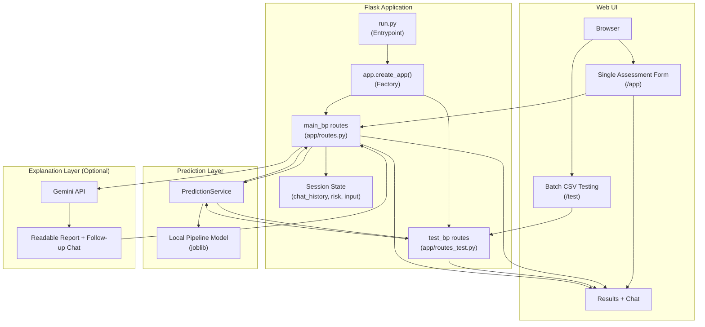

## Cardiac.AI: Intelligent Heart Disease Risk Prediction System with LLM-Based Clinical Explanation
`2026-03-13`

### Overview
Cardiac.AI is a Flask-based web application that predicts heart disease risk from clinical features and explains results in patient-friendly language.

The system combines:
- A trained Scikit-learn multiclass pipeline (`app/models/heart_risk_multiclass_pipeline.joblib`)
- A web UI for single-patient and CSV batch prediction
- Optional Gemini-powered explanation and chat support

### Architecture


### Features
- Single-patient risk prediction from a web form
- Batch CSV upload, preview, and prediction for up to 100 rows
- Risk class probabilities (`Low`, `Medium`, `High`, `Very High`)
- Human-readable explanation report
- Optional AI chat for lifestyle guidance after assessment
- CI smoke tests through GitHub Actions

### Project Structure
```text
Heart_risk_ML/
|-- .github/
|   `-- workflows/
|       `-- ci.yml
|-- app/
|   |-- __init__.py
|   |-- data.json
|   |-- routes.py
|   |-- routes_test.py
|   |-- models/
|   |   `-- heart_risk_multiclass_pipeline.joblib
|   |-- services/
|   |   `-- prediction_service.py
|   |-- static/
|   |   |-- css/
|   |   |   |-- style.css
|   |   |   `-- test.css
|   |   `-- js/
|   |       |-- index.js
|   |       `-- test.js
|   |-- templates/
|   |   |-- home.html
|   |   |-- index.html
|   |   `-- test.html
|   `-- utils/
|       `-- preprocessing.py
|-- test_data/
|   `-- Test_Heart_Risk_Data_V09 (1).csv
|-- Dockerfile
|-- Guide.txt
|-- pyproject.toml
|-- requirements.txt
`-- run.py
```

### Input Features
The model expects these fields:
- `age`
- `sex`
- `systolic_bp`
- `cholesterol`
- `bmi`
- `smoking`
- `diabetes`
- `resting_hr`
- `physical_activity`
- `family_history`

### Local Setup
```bash
python -m venv venv
# Windows PowerShell
venv\Scripts\Activate.ps1
pip install -r requirements.txt
```

### Run Application
```bash
python run.py
```

App URLs:
- Home: `http://127.0.0.1:5000/`
- Main app: `http://127.0.0.1:5000/app`
- Batch test: `http://127.0.0.1:5000/test`

### Environment Variables
- `SECRET_KEY`: Flask session secret
- `FLASK_ENV`: `development` or `testing`
- `FLASK_DEBUG`: `True` or `False`
- `GEMINI_API_KEY`: enables Gemini explanation/chat features
- `PORT`: server port (default `5000`)

### API Endpoints
- `GET /` home page
- `GET|POST /app` single-user prediction workflow
- `POST /chat` AI chat endpoint (requires prior assessment)
- `GET /test` batch test UI
- `POST /test/upload` CSV preview
- `POST /test/predict` batch prediction

### CI
GitHub Actions workflow: `.github/workflows/ci.yml`

Current CI validates:
- Python setup and dependency install
- Flask smoke tests for `/`, `/app`, and `/test/predict`

### Notes
- Predictions are screening estimates, not medical diagnoses.
- Gemini integration is optional; fallback explanations are used when unavailable.
